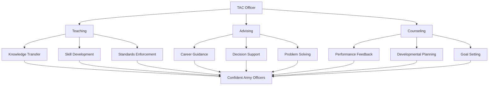

# TAC Officer Role & Mission

## Regulatory Foundation

**Key References:**
- AR 600-20 (Army Command Policy)
- AR 600-8-19 (Officer Professional Development)
- DA PAM 600-3 (Officer Professional Development)
- FM 6-22 (Leader Development)

---
title: TAC Officer Impact Framework
---

# TAC Officer Impact Framework

---
layout: two-cols
title: Army Values in TAC Leadership
---

# Army Values in TAC Leadership

- **Loyalty:** True faith to Constitution, Army, unit, and candidates
- **Duty:** Fulfill obligations and take responsibility
- **Respect:** Treat all with dignity and value diversity
- **Selfless Service:** Put candidate development and mission first

::right::

- **Honor:** Live up to Army Values and maintain integrity
- **Integrity:** Do what's right, legally and morally
- **Personal Courage:** Face adversity and stand up for what's right