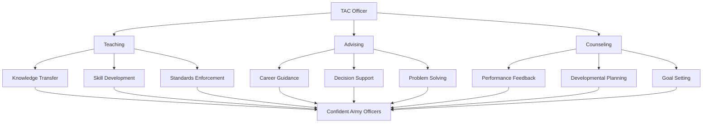

# TAC Officer Role & Mission

::left::

## **TAC = Teaching, Advising, Counseling**

- **Mentor** and develop officer candidates
- **Evaluate** performance against Army standards
- **Enforce** military discipline and values
- **Model** leadership excellence daily

## Core Responsibilities
- Conduct performance evaluations
- Provide developmental counseling
- Execute corrective training
- Maintain unit standards
- Foster team cohesion

::right::

## Regulatory Foundation

**Key References:**
- AR 600-20 (Army Command Policy)
- AR 600-8-19 (Officer Professional Development)
- DA PAM 600-3 (Officer Professional Development)
- FM 6-22 (Leader Development)

---

**Mission:** Develop adaptive, ethical, and effective leaders for the Army through comprehensive training, evaluation, and mentorship.

**Vision:** Transform motivated civilians into confident, competent Army officers who embody the Army Values and demonstrate exceptional leadership skills.

::

---
title: TAC Officer Impact Framework
---

# TAC Officer Impact Framework

---
title: Army Values in TAC Leadership
---

# Army Values in TAC Leadership

::grid{cols=2 gap=4}

::card{title="Loyalty" icon="🤝"}
- Bear true faith to the Constitution, Army, unit, and candidates
- Support chain of command decisions
- Advocate for candidate success
::

::card{title="Duty" icon="⚖️"}
- Fulfill obligations as assigned
- Take responsibility for actions and decisions
- Complete tasks to standard
::

::card{title="Respect" icon="🙏"}
- Treat all candidates with dignity
- Value diverse perspectives
- Foster inclusive environment
::

::card{title="Selfless Service" icon="🤲"}
- Put candidate development first
- Sacrifice personal comfort for mission
- Serve the greater good
::

::card{title="Honor" icon="🏆"}
- Live up to all Army Values
- Demonstrate moral courage
- Maintain integrity in all actions
::

::card{title="Integrity" icon="🎯"}
- Do what's right, legally and morally
- Be honest in all dealings
- Maintain transparency
::

::card{title="Personal Courage" icon="💪"}
- Face fear, danger, or adversity
- Take initiative when needed
- Stand up for what's right
::

::