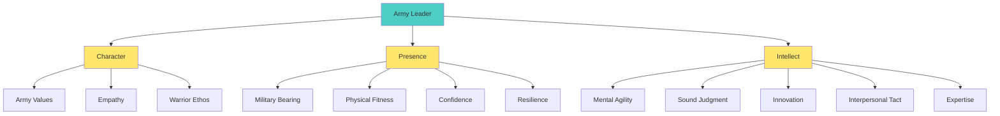
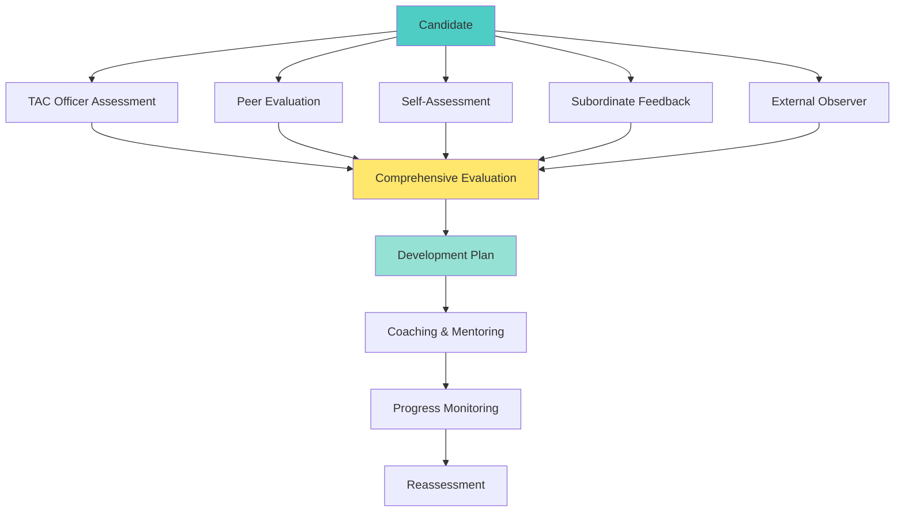
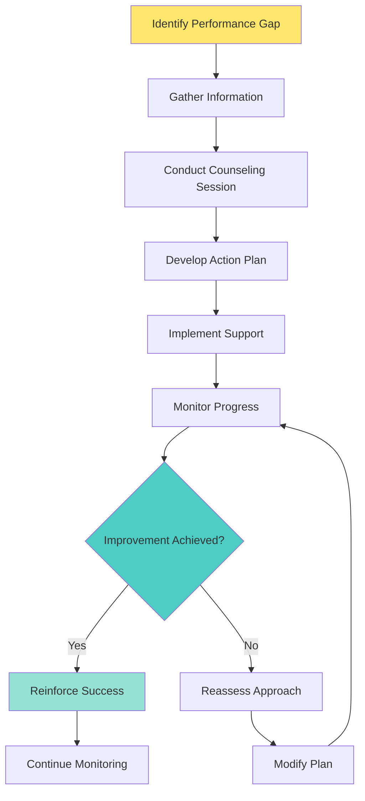

# Comprehensive Candidate Evaluation System

## **Evaluation Philosophy**

Evaluation is not just measurement—it's a developmental tool that guides candidate growth, identifies strengths and weaknesses, and ensures standards are met consistently and fairly.

::grid{cols=2 gap=6}

::card{title="Evaluation Principles" icon="⚖️"}
**Core Principles:**
- Standards-based assessment
- Continuous feedback
- Developmental focus
- Objective measurement
- Fair and consistent application
- Documented evidence

**Success Factors:**
- Clear criteria
- Multiple data sources
- Regular observation
- Timely feedback
- Constructive dialogue
- Growth-oriented approach
::

::card{title="Evaluation Framework" icon="📊"}
**Assessment Categories:**
- Leadership competencies
- Military bearing and discipline
- Physical fitness and readiness
- Technical and tactical proficiency
- Communication skills
- Ethical decision-making

**Measurement Methods:**
- Direct observation
- Performance testing
- Peer feedback
- Self-assessment
- Formal evaluations
- Continuous monitoring
::

::

---
title: Army Leadership Requirements Model
---

# Army Leadership Requirements Model

## **Core Leader Competencies**

::grid{cols=3 gap=4}

::card{title="Leading" icon="👨‍💼"}
**Competencies:**
- Leads others
- Builds trust
- Extends influence beyond chain of command
- Leads by example
- Communicates

**Evaluation Focus:**
- Initiative taking
- Team motivation
- Influence strategies
- Role modeling
- Communication effectiveness
::

::card{title="Developing" icon="🌱"}
**Competencies:**
- Creates positive environment
- Prepares self
- Develops others
- Stewards the profession

**Evaluation Focus:**
- Climate creation
- Self-development
- Mentoring others
- Professional growth
- Ethical leadership
::

::card{title="Achieving" icon="🎯"}
**Competencies:**
- Gets results
- Executes plans
- Adjusts to changing conditions
- Improves unit performance

**Evaluation Focus:**
- Mission accomplishment
- Execution quality
- Adaptability
- Performance improvement
- Resource management
::

::

---
title: Performance Standards and Metrics
---

# Performance Standards and Metrics

## **Graduated Performance Scale**

| **Level** | **Description** | **Characteristics** | **Development Action** |
|-----------|-----------------|---------------------|------------------------|
| **Exceeds Standards** | Consistently performs above expectations | Exceptional performance, natural leader, helps others | Provide advanced challenges |
| **Meets Standards** | Performs at expected level | Competent performance, follows procedures | Continue development |
| **Approaching Standards** | Shows improvement potential | Some deficiencies, needs guidance | Focused development plan |
| **Below Standards** | Significant improvement needed | Multiple deficiencies, requires intervention | Intensive remediation |

## **Evaluation Metrics Framework**

::grid{cols=2 gap=4}

::card{title="Quantitative Measures" icon="📈"}
**Measurable Indicators:**
- Physical fitness scores
- Academic test results
- Task completion rates
- Safety incident frequency
- Leadership position performance
- Peer evaluation scores

**Tracking Methods:**
- Performance databases
- Progress charts
- Trend analysis
- Comparative assessments
- Statistical reporting
::

::card{title="Qualitative Measures" icon="📝"}
**Observable Behaviors:**
- Leadership presence
- Communication effectiveness
- Team integration
- Problem-solving approach
- Ethical decision-making
- Adaptability under stress

**Assessment Methods:**
- Behavioral observations
- Scenario-based evaluations
- Peer feedback
- Self-reflections
- Interview assessments
::

::

---
title: Observation and Documentation Techniques
---

# Observation and Documentation Techniques

## **Systematic Observation Methods**

::columns

:::column{width="50%"}

### **Structured Observation**
- **Purpose:** Focused assessment of specific behaviors
- **Method:** Predetermined criteria and checklists
- **Frequency:** Regular, scheduled observations
- **Documentation:** Standardized forms and metrics

### **Unstructured Observation**
- **Purpose:** Holistic assessment of overall performance
- **Method:** Open-ended observation and note-taking
- **Frequency:** Continuous, opportunistic
- **Documentation:** Narrative descriptions and examples

:::

:::column{width="50%"}

### **Event Sampling**
- **Purpose:** Capture specific incidents or behaviors
- **Method:** Record when predetermined events occur
- **Frequency:** As events happen
- **Documentation:** Incident reports and examples

### **Time Sampling**
- **Purpose:** Systematic snapshot of behavior
- **Method:** Observe at regular intervals
- **Frequency:** Predetermined schedule
- **Documentation:** Time-stamped observations

:::

::

## **Documentation Best Practices**

::grid{cols=2 gap=6}

::card{title="What to Document" icon="📋"}
**Essential Elements:**
- Specific behaviors observed
- Date, time, and location
- Context and circumstances
- Objective facts, not opinions
- Supporting evidence
- Witness information

**Examples:**
- "Candidate Smith took initiative during patrol planning session on 15 Jan 24"
- "Demonstrated clear communication during radio procedures exercise"
- "Showed respect for peers during conflict resolution"
::

::card{title="Documentation Standards" icon="✅"}
**Quality Standards:**
- Factual and objective
- Specific and detailed
- Timely and current
- Legible and professional
- Consistent format
- Legally defensible

**Avoid:**
- Subjective opinions
- Assumptions or speculation
- Vague generalizations
- Inflammatory language
- Personal bias
- Incomplete information
::

::

---
title: Multi-Source Feedback System
---

# Multi-Source Feedback System

## **360-Degree Feedback Framework**

## **Feedback Sources and Methods**

::grid{cols=2 gap=4}

::card{title="Supervisor Assessment" icon="👨‍💼"}
**TAC Officer Evaluation:**
- Direct observation
- Performance coaching
- Formal evaluations
- Continuous monitoring
- Development planning

**Focus Areas:**
- Leadership competencies
- Task performance
- Professional growth
- Standards adherence
- Potential assessment
::

::card{title="Peer Evaluation" icon="👥"}
**Peer Feedback System:**
- Anonymous assessments
- Team integration
- Collaboration skills
- Reliability measures
- Leadership among peers

**Benefits:**
- Different perspective
- Team dynamics insight
- Authentic feedback
- Peer accountability
- Leadership validation
::

::card{title="Self-Assessment" icon="🪞"}
**Self-Evaluation Process:**
- Structured self-reflection
- Goal setting
- Progress monitoring
- Strengths identification
- Development planning

**Tools:**
- Self-assessment forms
- Reflection journals
- Goal tracking sheets
- Progress portfolios
- Development plans
::

::card{title="Subordinate Feedback" icon="⬇️"}
**Subordinate Assessment:**
- Leadership effectiveness
- Communication skills
- Decision-making quality
- Support and development
- Trust and respect

**Methods:**
- Anonymous surveys
- Focus groups
- Individual interviews
- Observation reports
- Performance metrics
::

::

---
title: Performance Counseling and Development
---

# Performance Counseling and Development

## **Developmental Counseling Framework**

::columns

:::column{width="50%"}

### **Counseling Types**
- **Event-Oriented:** Specific incidents
- **Performance:** Regular assessments
- **Professional Growth:** Career development
- **Crisis:** Serious issues
- **Separation:** Departure preparation

### **Counseling Frequency**
- **Daily:** Informal feedback
- **Weekly:** Progress reviews
- **Monthly:** Formal counseling
- **Quarterly:** Comprehensive assessment
- **As-needed:** Specific events

:::

:::column{width="50%"}

### **Counseling Objectives**
- Performance improvement
- Goal setting and tracking
- Problem identification
- Resource provision
- Relationship building

### **Documentation Requirements**
- DA Form 4856 completion
- Specific examples
- Clear expectations
- Action plans
- Follow-up schedules

:::

::

## **Performance Improvement Process**

---
title: Evaluation Tools and Forms
---

# Evaluation Tools and Forms

## **OCS Evaluation Forms System**

::grid{cols=2 gap=4}

::card{title="Blue Card (In-Brief)" icon="🔵"}
**ARNGOCS Form 2**
- Pre-leadership counseling
- Expectation setting
- Performance standards
- Success criteria definition

**Use:** Before leadership assignment
**Purpose:** Clear expectations
**Duration:** One-time per position
::

::card{title="Yellow Card (Self-Assessment)" icon="🟡"}
**ARNGOCS Form 4**
- Candidate self-evaluation
- Time-Event-Result format
- Strengths identification
- Improvement areas

**Use:** During leadership period
**Purpose:** Self-reflection
**Duration:** Ongoing process
::

::card{title="Green Card (LOR)" icon="🟢"}
**ARNGOCS Form 3**
- Leadership observation
- Specific behavior documentation
- Corrective action identification
- Performance feedback

**Use:** As needed for issues
**Purpose:** Behavior correction
**Duration:** Incident-specific
::

::card{title="White Paper (LER)" icon="⚪"}
**ARNGOCS Form 1**
- Formal evaluation
- Comprehensive assessment
- Performance rating
- Development recommendations

**Use:** End of leadership period
**Purpose:** Official evaluation
**Duration:** Final assessment
::

::

## **Evaluation Timeline and Process**

| **Phase** | **Timeline** | **Actions** | **Forms** |
|-----------|-------------|-------------|-----------|
| **Pre-Assignment** | Before leadership | Counseling, expectations | Blue Card |
| **Ongoing** | During assignment | Observation, feedback | Green Card |
| **Self-Assessment** | Mid-assignment | Self-evaluation | Yellow Card |
| **Final Evaluation** | End of assignment | Formal assessment | White Paper |
| **Post-Evaluation** | Within 24 hours | Counseling session | LER Review |

---
title: Performance Standards Documentation
---

# Performance Standards Documentation

## **Evidence-Based Assessment**

::grid{cols=2 gap=6}

::card{title="Strong Evidence" icon="💪"}
**Indicators:**
- Multiple observations
- Consistent behavior patterns
- Specific examples
- Measurable outcomes
- Peer corroboration
- Documented incidents

**Documentation:**
- Detailed behavior descriptions
- Time and date stamps
- Witness statements
- Performance metrics
- Photo/video evidence
- Written reports
::

::card{title="Weak Evidence" icon="⚠️"}
**Indicators:**
- Single observations
- Inconsistent patterns
- Vague descriptions
- Assumptions or hearsay
- Personal opinions
- Incomplete information

**Improvement:**
- Gather more data
- Seek multiple perspectives
- Document specific examples
- Verify facts
- Remove bias
- Complete assessments
::

::

## **Common Evaluation Errors**

::columns

:::column{width="50%"}

### **Rater Errors**
- **Halo Effect:** Overall impression influences all ratings
- **Leniency:** Consistently high ratings
- **Severity:** Consistently low ratings
- **Central Tendency:** All ratings in middle range
- **Recency:** Recent events overshadow overall performance

### **Prevention Strategies**
- Use specific examples
- Consider entire rating period
- Apply consistent standards
- Seek multiple perspectives
- Document continuously

:::

:::column{width="50%"}

### **Logical Errors**
- **Attribution:** Assuming intent from behavior
- **Confirmation Bias:** Seeking confirming evidence
- **Anchoring:** Over-relying on first impressions
- **Contrast Effect:** Comparing candidates to each other
- **Stereotyping:** Applying group characteristics

### **Mitigation Techniques**
- Focus on observed behavior
- Seek disconfirming evidence
- Remain open to change
- Use individual standards
- Evaluate each person individually

:::

::

> **Remember:** Evaluation is a continuous process of observation, documentation, feedback, and development. The goal is to help candidates succeed while maintaining high standards. 