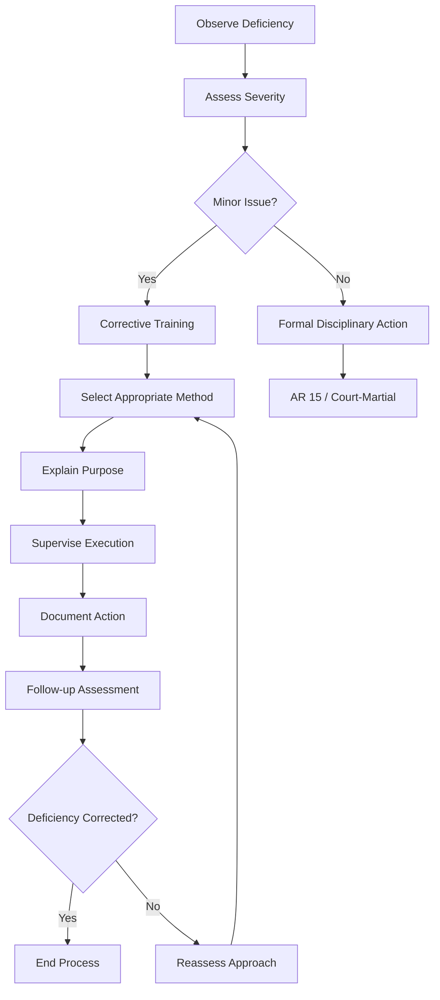

# Corrective Training - Legal Framework

::left::

## **AR 600-20 Authority**

**Para 4-6b(1):** "Brief physical exercises are an acceptable form of corrective training for minor acts of indiscipline (for example, requiring the Soldier to do push-ups for arriving late to formation), so long as it does not violate the Army's policies prohibiting hazing, bullying, and unlawful punishment."

## Key Principles
- **Directly Related** to deficiency
- **Educational** in nature
- **Non-punitive** approach
- **Time-limited** duration
- **Proportional** to offense

::right::

## **Legal Boundaries**

**What It IS:**
- Training to correct deficiencies
- Educational reinforcement
- Performance improvement
- Standards maintenance

**What It's NOT:**
- Punishment
- Hazing or bullying
- Retaliation
- Excessive or oppressive

::

---
title: Authorized Corrective Exercises
---

# Authorized Corrective Exercises

::grid{cols=3 gap=4}

::card{title="Upper Body" icon="💪"}
- Rower
- Push-up
- Prone row
- 8-count push-up
- Swimmer
::

::card{title="Core" icon="🎯"}
- V-up
- Leg tuck and twist
- Supine bicycle
::

::card{title="Lower Body" icon="🦵"}
- Squat bender
- Windmill
::

::

---

## **Critical Limitations**

| **Requirement** | **Standard** |
|-----------------|--------------|
| **Exercises per session** | Only ONE exercise |
| **Maximum repetitions** | FIVE (5) repetitions |
| **Frequency** | Consider cumulative effect |
| **Duration** | Until deficiency corrected |
| **Timing** | May be after duty hours |

> **WARNING:** Failure to follow these limitations may constitute hazing, bullying, or unlawful punishment under AR 600-20.

---
title: Non-Exercise Corrective Actions
---

# Non-Exercise Corrective Actions

::grid{cols=2 gap=6}

::card{title="Drill & Ceremony" icon="🎖️"}
**Purpose:** Reinforce attention to detail and discipline

**Examples:**
- Repeating drill movements
- Position of attention practice
- Marching corrections
- Uniform inspections

**Key:** Must relate to observed deficiency
::

::card{title="Task Repetition" icon="🔄"}
**Purpose:** Build muscle memory and competence

**Examples:**
- Weapon clearing procedures
- Radio communication drills
- Equipment maintenance
- Safety procedures

**Key:** Practice until standard is met
::

::card{title="Written Reflection" icon="📝"}
**Purpose:** Develop critical thinking and self-awareness

**Examples:**
- After-action reviews
- Leadership philosophy papers
- Standard operating procedures
- Improvement plans

**Key:** Promote self-reflection and ownership
::

::card{title="Leadership Rotations" icon="👥"}
**Purpose:** Address teamwork and leadership deficiencies

**Examples:**
- Temporary leadership assignments
- Peer mentoring roles
- Team building exercises
- Conflict resolution practice

**Key:** Provide growth opportunities
::

::

---
title: Corrective Training Process
---

# Corrective Training Process

---
title: The 4W Method of Corrective Training
---

# The 4W Method of Corrective Training

::grid{cols=2 gap=6}

::card{title="WHAT" icon="❓"}
**Identify the specific issue**
- Clearly state the deficiency
- Be specific and factual
- Avoid generalizations
- Focus on observable behavior

*Example: "You arrived 5 minutes late to formation"*
::

::card{title="WHERE" icon="📍"}
**Explain the context**
- When did it occur?
- What were the circumstances?
- How does it affect the unit?
- What standard was violated?

*Example: "During morning accountability formation in the company area"*
::

::card{title="WHY" icon="🤔"}
**Discuss the importance**
- Why is this standard important?
- How does it affect readiness?
- What are the consequences?
- Connect to Army Values

*Example: "Punctuality demonstrates respect for others and unit readiness"*
::

::card{title="HOW" icon="🛠️"}
**Provide the solution**
- What must be done differently?
- What resources are available?
- How will progress be measured?
- Set clear expectations

*Example: "Set multiple alarms and arrive 10 minutes early to all formations"*
::

::

---
title: Additional Guidance
---

# Additional Guidance

- For documentation requirements, see [Counseling & Feedback](./tac-12-counseling-feedback.md) and [Evaluation System](./tac-03-evaluation.md).
- For escalation procedures, see [Limitations of TAC Officers](./tac-05-limitations.md).
- For common mistakes and pitfalls, see [Common Pitfalls & Solutions](./tac-15-common-pitfalls.md).

> Focus corrective training on development, not punishment. When in doubt, consult legal or senior TAC guidance.