# Risk Management and Safety

## **TAC Officer Safety Responsibilities**

As a TAC officer, you are responsible for the safety and welfare of all candidates under your supervision. This includes physical safety, emotional well-being, and operational security.

::grid{cols=2 gap=6}

::card{title="Physical Safety" icon="🛡️"}
**Key Areas:**
- Training environment hazards
- Equipment safety checks
- Environmental conditions
- Medical emergencies
- Physical training risks

**Actions:**
- Conduct safety briefings
- Inspect training areas
- Monitor weather conditions
- Maintain first aid readiness
::

::card{title="Emotional Well-being" icon="🧠"}
**Key Areas:**
- Stress management
- Mental health awareness
- Hazing prevention
- Peer support systems
- Crisis intervention

**Actions:**
- Recognize warning signs
- Provide counseling resources
- Foster supportive environment
- Report concerns promptly
::

::

---
title: Risk Assessment Process
---

# Risk Assessment Process

---
title: Risk Management Matrix
---

# Risk Management Matrix

## **Probability vs. Severity Assessment**

| **Probability** | **Catastrophic** | **Critical** | **Moderate** | **Negligible** |
|-----------------|------------------|--------------|--------------|----------------|
| **Frequent**    | **Extremely High** | **High** | **High** | **Medium** |
| **Likely**      | **High** | **High** | **Medium** | **Low** |
| **Occasional**  | **High** | **Medium** | **Medium** | **Low** |
| **Seldom**      | **Medium** | **Medium** | **Low** | **Low** |
| **Unlikely**    | **Medium** | **Low** | **Low** | **Low** |

## **Risk Response Actions**

::grid{cols=2 gap=4}

::card{title="Extremely High Risk" icon="🚨"}
**Action:** STOP activity immediately
- Requires immediate action
- Cannot continue without mitigation
- Senior leadership approval required
- Comprehensive safety review needed
::

::card{title="High Risk" icon="⚠️"}
**Action:** Implement controls before proceeding
- Detailed mitigation plan required
- Additional safety measures needed
- Supervisor approval required
- Continuous monitoring essential
::

::card{title="Medium Risk" icon="🟡"}
**Action:** Implement controls as time permits
- Standard safety procedures apply
- Monitor for changes
- Document controls implemented
- Regular assessment needed
::

::card{title="Low Risk" icon="🟢"}
**Action:** Accept risk with routine precautions
- Normal safety procedures sufficient
- Periodic monitoring adequate
- Standard documentation required
- Routine risk assessment
::

::

---
title: Training Safety Standards
layout: two-cols
---

# Training Safety Standards

## **Physical Training Safety**

### **Pre-Training Checks**
- Medical clearance verification
- Equipment inspection
- Environmental assessment
- Personnel accountability
- Safety briefing completion

### **During Training**
- Continuous monitoring
- Hydration enforcement
- Rest period management
- Equipment maintenance
- Immediate correction of unsafe acts

::right::

### **Post-Training**
- Personnel accountability
- Equipment inspection
- Incident reporting
- Medical evaluation if needed
- After-action review

### **Common Hazards**
- Heat-related injuries
- Dehydration
- Equipment failure
- Overexertion
- Environmental hazards

## **Field Training Safety**

| **Safety Area** | **Requirements** | **Verification** |
|-----------------|------------------|------------------|
| **Equipment** | Proper inspection, maintenance | Daily checks, fault reporting |
| **Environment** | Weather, terrain, hazards | Continuous monitoring |
| **Personnel** | Proper training, medical status | Qualification verification |
| **Procedures** | Standard operating procedures | Rehearsals, briefings |
| **Communication** | Primary/alternate means | Radio checks, signals |

---
title: Incident Reporting and Investigation
---

# Incident Reporting and Investigation

## **Incident Classification**

::grid{cols=3 gap=4}

::card{title="Class A" icon="🔴"}
**Criteria:**
- Fatality or permanent disability
- Property damage >$2M
- Complete mission failure

**Reporting:** Immediate
**Investigation:** Formal board
::

::card{title="Class B" icon="🟠"}
**Criteria:**
- Hospitalization >24 hours
- Property damage $500K-$2M
- Significant mission impact

**Reporting:** 24 hours
**Investigation:** Formal investigation
::

::card{title="Class C" icon="🟡"}
**Criteria:**
- Lost duty time
- Property damage $50K-$500K
- Minor mission impact

**Reporting:** 72 hours
**Investigation:** Local investigation
::

::

## **Investigation Process**

```mermaid
flowchart LR
    A[Incident Occurs] --> B[Secure Scene]
    B --> C[Provide Care]
    C --> D[Notify Command]
    D --> E[Preserve Evidence]
    E --> F[Initial Investigation]
    F --> G[Formal Investigation]
    G --> H[Analysis & Findings]
    H --> I[Recommendations]
    I --> J[Implementation]
    J --> K[Follow-up]
```

## **Documentation Requirements**

**Immediate Actions:**
- Preliminary report within 24 hours
- Witness statements
- Photographs of scene
- Medical records
- Equipment inspection reports

**Follow-up Actions:**
- Detailed incident report
- Root cause analysis
- Corrective action plan
- Lessons learned
- Training updates

---
title: Safety Culture and Leadership
---

# Safety Culture and Leadership

## **Building a Safety-First Culture**

::grid{cols=2 gap=6}

::card{title="Leadership Actions" icon="👨‍💼"}
**Model Safety:**
- Follow all safety procedures
- Wear required PPE
- Stop unsafe actions immediately
- Reward safe behavior
- Address safety concerns promptly

**Communicate Effectively:**
- Regular safety discussions
- Clear safety expectations
- Open reporting environment
- Feedback on safety performance
- Lessons learned sharing
::

::card{title="Candidate Engagement" icon="👥"}
**Empower Candidates:**
- Encourage safety reporting
- Train safety procedures
- Recognize safe actions
- Support safety initiatives
- Create safety ownership

**Build Competence:**
- Provide proper training
- Ensure understanding
- Verify competence
- Maintain proficiency
- Update procedures regularly
::

::

## **Safety Performance Indicators**

| **Indicator** | **Measurement** | **Target** |
|---------------|-----------------|------------|
| **Incident Rate** | Incidents per 1000 training hours | <1.0 |
| **Near Miss Reports** | Reports per month | >10 |
| **Safety Training** | % Personnel current | 100% |
| **PPE Compliance** | % Observed compliance | >95% |
| **Safety Inspections** | % Completed on time | 100% |

## **Continuous Improvement**

1. **Regular Assessment** - Monthly safety reviews
2. **Data Analysis** - Trend identification and analysis
3. **Corrective Actions** - Implementation and tracking
4. **Training Updates** - Based on lessons learned
5. **System Enhancement** - Continuous improvement process

> **Remember:** Safety is everyone's responsibility, but leaders set the tone and standards for the entire unit. 