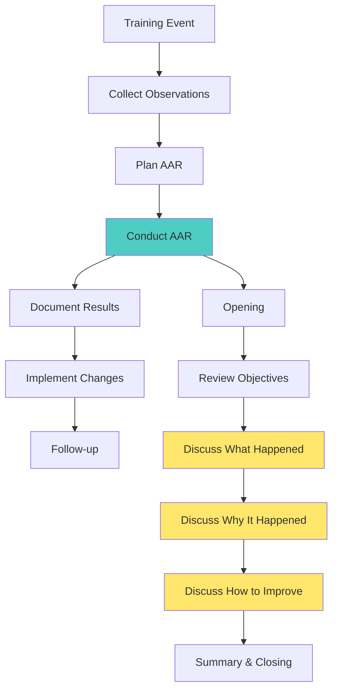

# After Action Review (AAR) Process

## **Purpose and Importance**

The After Action Review (AAR) is a professional discussion that focuses on performance standards and enables candidates to discover what happened, why it happened, and how to sustain strengths and improve on weaknesses.

::grid{cols=2 gap=6}

::card{title="AAR Benefits" icon="🎯"}
**For Candidates:**
- Identifies strengths and weaknesses
- Reinforces learning objectives
- Builds critical thinking skills
- Promotes self-awareness
- Encourages continuous improvement

**For TAC Officers:**
- Assesses training effectiveness
- Identifies systemic issues
- Reinforces teaching points
- Builds unit cohesion
- Validates training methods
::

::card{title="AAR Principles" icon="📋"}
**Core Principles:**
- Everyone participates
- No blame or punishment
- Focus on standards, not personalities
- Determine facts, not opinions
- Emphasize what can be learned
- Allow candidates to lead discovery

**Success Factors:**
- Properly planned and resourced
- Skilled facilitator
- Supportive environment
- Relevant and timely
- Action-oriented outcomes
::

::

---
title: AAR Process Overview
---

# AAR Process Overview



## **The Four Key Questions**

::grid{cols=2 gap=4}

::card{title="1. What was supposed to happen?" icon="🎯"}
- Review mission/training objectives
- Identify intended outcomes
- Establish performance standards
- Clarify expectations
::

::card{title="2. What actually happened?" icon="📊"}
- Gather factual observations
- Identify actual outcomes
- Document events chronologically
- Avoid speculation or opinion
::

::card{title="3. Why did it happen?" icon="🔍"}
- Analyze root causes
- Identify contributing factors
- Examine decisions and actions
- Explore systemic issues
::

::card{title="4. How can we improve?" icon="🚀"}
- Identify lessons learned
- Develop action plans
- Assign responsibilities
- Set timelines for implementation
::

::

---
title: AAR Facilitation Techniques
---

# AAR Facilitation Techniques

## **Facilitator Roles and Responsibilities**

::columns

:::column{width="50%"}

### **Before the AAR**
- Gather relevant data and observations
- Prepare discussion questions
- Set up appropriate environment
- Review training objectives
- Plan time allocation

### **During the AAR**
- Guide discussion, don't dominate
- Ask probing questions
- Encourage participation
- Keep discussion focused
- Manage time effectively

:::

:::column{width="50%"}

### **After the AAR**
- Document key findings
- Track action items
- Distribute summary
- Follow up on improvements
- Assess AAR effectiveness

### **Key Skills**
- Active listening
- Effective questioning
- Conflict resolution
- Group facilitation
- Critical thinking

:::

::

## **Effective Questioning Techniques**

| **Question Type** | **Purpose** | **Examples** |
|-------------------|-------------|--------------|
| **Open-ended** | Encourage discussion | "What did you observe during...?" |
| **Probing** | Get details | "Can you explain why you decided to...?" |
| **Hypothetical** | Explore alternatives | "What would have happened if...?" |
| **Leading** | Guide to insights | "How might we improve...?" |
| **Clarifying** | Ensure understanding | "Are you saying that...?" |

---
title: AAR Planning and Preparation
---

# AAR Planning and Preparation

## **Pre-AAR Planning Checklist**

::grid{cols=2 gap=4}

::card{title="Data Collection" icon="📊"}
**Essential Information:**
- Training objectives
- Observation notes
- Performance metrics
- Timeline of events
- Resource utilization
- Safety incidents

**Sources:**
- Observer/controller notes
- Video recordings
- Participant feedback
- Performance measures
- Equipment status
::

::card{title="Environmental Setup" icon="🏢"}
**Physical Arrangement:**
- Appropriate location
- Circle or U-shape seating
- Visual aids available
- Minimal distractions
- Comfortable temperature
- Adequate lighting

**Materials Needed:**
- Flip charts/whiteboards
- Markers
- Handouts
- Training aids
- Documentation forms
::

::

## **Timing Considerations**

**When to Conduct:**
- Immediately after training event (preferred)
- Within 24 hours maximum
- When participants are available
- In neutral, non-threatening environment

**Duration Guidelines:**
- Simple tasks: 15-30 minutes
- Complex exercises: 45-90 minutes
- Major training events: 2-4 hours
- Multi-day exercises: Daily mini-AARs plus final comprehensive AAR

---
title: AAR Execution Guidelines
---

# AAR Execution Guidelines

## **Opening Phase (5-10 minutes)**

::grid{cols=2 gap=4}

::card{title="Set the Climate" icon="🌟"}
**Establish:**
- Purpose of the AAR
- Ground rules for participation
- Non-threatening environment
- Focus on learning, not blame
- Confidentiality agreements

**Ground Rules:**
- Everyone participates
- Stay focused on objectives
- Be honest and constructive
- Respect different viewpoints
- No rank in the room
::

::card{title="Review Objectives" icon="📋"}
**Cover:**
- Original training objectives
- Performance standards
- Success criteria
- Timeline and sequence
- Resource allocation

**Questions:**
- "What were we trying to accomplish?"
- "What standards were we measured against?"
- "What was our timeline?"
::

::

## **Discussion Phase (Main Body)**

### **What Happened? (30-40% of time)**

- **Chronological Review:** Walk through events step by step
- **Factual Focus:** Stick to observable facts, not opinions
- **Multiple Perspectives:** Get input from different participants
- **Key Events:** Identify critical decision points and actions

### **Why Did It Happen? (30-40% of time)**

- **Root Cause Analysis:** Dig deeper into underlying causes
- **System Analysis:** Examine processes, procedures, and resources
- **Decision Analysis:** Evaluate decision-making processes
- **Contributing Factors:** Identify environmental and human factors

### **How Can We Improve? (20-30% of time)**

- **Sustain Strengths:** Identify what worked well
- **Improve Weaknesses:** Develop specific action plans
- **Prevent Recurrence:** Address systemic issues
- **Assign Responsibilities:** Who will do what by when

---
title: AAR Documentation and Follow-up
---

# AAR Documentation and Follow-up

## **Documentation Requirements**

::columns

:::column{width="50%"}

### **Immediate Documentation**
- Key discussion points
- Lessons learned
- Action items assigned
- Strengths to sustain
- Areas for improvement

### **Formal AAR Report**
- Executive summary
- Training objectives vs. outcomes
- Detailed findings
- Recommendations
- Implementation timeline

:::

:::column{width="50%"}

### **Distribution List**
- Participants
- Chain of command
- Training department
- Other relevant units
- Lessons learned database

### **Follow-up Actions**
- Track implementation
- Measure effectiveness
- Share best practices
- Update procedures
- Plan future training

:::

::

## **AAR Report Template**

```
AFTER ACTION REVIEW REPORT

1. Training Event: [Name and Date]
2. Participants: [List of attendees]
3. Objectives: [What was supposed to happen]
4. Outcomes: [What actually happened]
5. Strengths: [What went well]
6. Areas for Improvement: [What needs work]
7. Lessons Learned: [Key takeaways]
8. Action Items: [Who, What, When]
9. Recommendations: [Future improvements]
10. Next Steps: [Follow-up actions]
```

---
title: Common AAR Pitfalls and Solutions
---

# Common AAR Pitfalls and Solutions

::grid{cols=2 gap=6}

::card{title="Common Pitfalls" icon="⚠️"}
**Facilitator Issues:**
- Dominating the discussion
- Allowing blame/punishment focus
- Poor time management
- Inadequate preparation
- Lack of follow-through

**Participant Issues:**
- Reluctance to participate
- Defensive attitudes
- Side conversations
- Focus on personalities
- Superficial analysis

**Process Issues:**
- Unclear objectives
- Poor environment
- Inadequate time
- Missing key participants
- No documentation
::

::card{title="Solutions" icon="✅"}
**Facilitator Solutions:**
- Use open-ended questions
- Guide, don't tell
- Manage time actively
- Prepare thoroughly
- Document and follow up

**Participant Solutions:**
- Establish ground rules
- Create safe environment
- Encourage participation
- Focus on facts
- Promote learning mindset

**Process Solutions:**
- Clear objectives
- Appropriate setting
- Adequate time allocation
- Ensure participation
- Document thoroughly
::

::

## **AAR Success Metrics**

| **Metric** | **Measurement** | **Target** |
|------------|-----------------|------------|
| **Participation** | % Active participants | >80% |
| **Time Management** | On-time completion | 100% |
| **Action Items** | Items completed on time | >90% |
| **Satisfaction** | Participant feedback | >4.0/5.0 |
| **Learning** | Improved performance | Measurable |

---
title: Virtual and Remote AAR Considerations
---

# Virtual and Remote AAR Considerations

## **Technology and Platform Requirements**

::grid{cols=2 gap=4}

::card{title="Platform Features" icon="💻"}
**Essential Capabilities:**
- Video conferencing
- Screen sharing
- Breakout rooms
- Recording capability
- Chat functionality
- Whiteboard tools

**Recommended Platforms:**
- Microsoft Teams
- Zoom
- Google Meet
- WebEx
- Dedicated AAR software
::

::card{title="Technical Preparation" icon="🔧"}
**Before the AAR:**
- Test all technology
- Prepare backup plans
- Share materials in advance
- Ensure internet connectivity
- Brief participants on tools

**During the AAR:**
- Have technical support
- Monitor connections
- Use multiple communication methods
- Record for later review
- Manage virtual environment
::

::

## **Virtual AAR Best Practices**

::columns

:::column{width="50%"}

### **Engagement Strategies**
- Shorter time blocks (45-60 minutes max)
- Frequent interaction checks
- Use polls and breakout rooms
- Encourage camera use
- Active facilitation required

### **Communication Techniques**
- Clear speaking with pauses
- Visual aids and presentations
- Chat for questions/comments
- Structured turn-taking
- Written summary distributed

:::

:::column{width="50%"}

### **Documentation Methods**
- Real-time collaborative documents
- Digital whiteboards
- Screen capture of discussions
- Chat logs preservation
- Automated meeting transcripts

### **Follow-up Considerations**
- Distributed materials
- Recorded sessions for review
- Digital action tracking
- Virtual check-ins
- Online resource sharing

:::

::

> **Remember:** The AAR is a learning tool, not a performance evaluation. Focus on helping candidates discover insights for themselves rather than telling them what they should have done. 