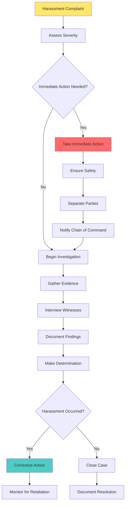

# Legal Compliance and Regulatory Framework

## **Key Legal Authority and Regulations**

As a TAC officer, you must operate within the legal framework established by federal law, Department of Defense directives, and Army regulations. Understanding these requirements is essential for effective and lawful leadership.

::grid{cols=2 gap=6}

::card{title="Federal Law" icon="🇺🇸"}
**Key Statutes:**
- Uniform Code of Military Justice (UCMJ)
- Civil Rights Act of 1964
- Americans with Disabilities Act (ADA)
- Lautenberg Amendment (Gun Control Act)
- Family and Medical Leave Act (FMLA)

**Compliance Requirements:**
- Due process rights
- Equal opportunity
- Reasonable accommodation
- Domestic violence reporting
- Protected activities
::

::card{title="Army Regulations" icon="📜"}
**Primary Regulations:**
- AR 600-20 (Army Command Policy)
- AR 600-8-19 (Officer Professional Development)
- AR 27-10 (Military Justice)
- AR 635-200 (Personnel Separations)
- AR 350-1 (Training and Leader Development)

**Key Areas:**
- Command authority
- Corrective training
- Military justice
- Administrative separations
- Training safety
::

::

---
title: Command Authority and Legal Boundaries
---

# Command Authority and Legal Boundaries

---
title: Sources of Authority
layout: two-cols
---

# Sources of Authority

### **Legal Authority**
- **Constitutional:** Article I, Section 8
- **Statutory:** UCMJ, Title 10 USC
- **Regulatory:** AR 600-20, para 4-6
- **Delegated:** Chain of command

### **Scope of Authority**
- **Personnel:** Under your command
- **Geographic:** Assigned area
- **Functional:** Specific duties
- **Temporal:** Duration of assignment

::right::

### **Authority Limitations**
- **Legal:** Cannot violate law
- **Regulatory:** Must follow regulations
- **Proportional:** Must be reasonable
- **Due Process:** Must be fair

### **Delegation Principles**
- **Clear:** Specific instructions
- **Appropriate:** Suitable level
- **Accountable:** Maintain responsibility
- **Supervised:** Monitor execution

## **Legal Boundaries Matrix**

| **Action** | **Legal** | **Regulatory Authority** | **Approval Required** |
|------------|-----------|-------------------------|----------------------|
| **Corrective Training** | AR 600-20, para 4-6b | Company Commander | None (within limits) |
| **Counseling** | AR 600-8-19 | TAC Officer | None |
| **Administrative Action** | AR 635-200 | Battalion Commander | Yes |
| **Non-Judicial Punishment** | UCMJ Art 15 | Company Commander | Yes |
| **Court-Martial** | UCMJ | Convening Authority | Yes |

---
title: Equal Opportunity and Civil Rights
---

# Equal Opportunity and Civil Rights

## **Protected Categories**

Equal Opportunity (EO) violations occur when personnel are treated differently based on protected characteristics.

::grid{cols=3 gap=4}

::card{title="Federal Protected Classes" icon="⚖️"}
**Protected Categories:**
- Race
- Color  
- Religion
- Sex
- National origin
- Age (40+)
- Disability
- Genetic information

**Legal Basis:**
- Civil Rights Act 1964
- Americans with Disabilities Act
- Age Discrimination Act
- Genetic Information Nondiscrimination Act
::

::card{title="DoD Protected Classes" icon="🏛️"}
**Additional Categories:**
- Sexual orientation
- Gender identity
- Parental status
- Marital status
- Political affiliation (limited)

**Legal Basis:**
- DoD Directive 1020.02E
- Executive Orders
- Service regulations
::

::card{title="Prohibited Actions" icon="🚫"}
**Unlawful Discrimination:**
- Disparate treatment
- Harassment
- Retaliation
- Hostile environment
- Failure to accommodate

**Examples:**
- Biased evaluations
- Exclusion from opportunities
- Offensive comments
- Unequal punishment
- Denial of religious needs
::

::

---
title: Religious Accommodation
layout: two-cols
---

# Religious Accommodation

### **Accommodation Process**
1. **Request:** Candidate submits request
2. **Review:** Assess impact on mission
3. **Decision:** Approve or deny with rationale
4. **Appeal:** Process available if denied
5. **Monitor:** Ensure compliance

### **Common Accommodations**
- Religious dietary needs
- Worship time/schedule
- Uniform modifications
- Grooming standards
- Holy day observances

::right::

### **Approval Criteria**
- **Compelling Government Interest:** Mission impact
- **Least Restrictive Means:** Minimal burden
- **Unit Readiness:** Operational capability
- **Safety:** No increased risk
- **Uniformity:** Discipline and morale

### **Documentation Requirements**
- Written request
- Impact assessment
- Decision rationale
- Appeal process
- Monitoring plan

---
title: Harassment Prevention and Response
---

# Harassment Prevention and Response

## **Types of Harassment**

::grid{cols=2 gap=4}

::card{title="Discriminatory Harassment" icon="🎯"}
**Definition:** Unwelcome conduct based on protected characteristics that creates hostile environment

**Elements:**
- Based on protected category
- Unwelcome conduct
- Severe or pervasive
- Creates hostile environment
- Interferes with performance

**Examples:**
- Racial slurs or jokes
- Religious mockery
- Gender-based insults
- Sexual comments
- Disability ridicule
::

::card{title="General Harassment" icon="⚠️"}
**Definition:** Bullying, hazing, or other conduct that undermines dignity and respect

**Behaviors:**
- Hazing activities
- Bullying conduct
- Cyber harassment
- Retaliation
- Ostracism

**Impact:**
- Undermines trust
- Degrades readiness
- Violates Army ethic
- Creates hostile climate
- Affects performance
::

::

## **Response Procedures**

---
title: Due Process and Administrative Actions
---

# Due Process and Administrative Actions

## **Due Process Requirements**

::columns

:::column{width="50%"}

### **Procedural Due Process**
- **Notice:** Adequate information about allegations
- **Opportunity:** Chance to respond and present evidence
- **Impartial:** Neutral decision-maker
- **Timely:** Reasonable time to prepare
- **Record:** Documentation of proceedings

### **Administrative Actions**
- **Counseling:** Developmental guidance
- **Reprimand:** Formal disapproval
- **Relief:** Removal from position
- **Separation:** Discharge from service
- **Reduction:** Grade/rank decrease

::right::

### **Constitutional Rights**
- **Fifth Amendment:** Self-incrimination protection
- **Sixth Amendment:** Right to counsel (criminal)
- **Fourteenth Amendment:** Equal protection
- **First Amendment:** Speech/religion (limited)
- **Fourth Amendment:** Search/seizure

### **UCMJ Rights**
- **Article 31:** Rights warning
- **Article 32:** Preliminary hearing
- **Article 38:** Right to counsel
- **Article 46:** Opportunity to obtain witnesses
- **Article 44:** Former jeopardy

## **Administrative vs. Punitive Actions**

| **Administrative** | **Punitive** |
|-------------------|--------------|
| **Purpose:** Correct/separate | **Purpose:** Punish misconduct |
| **Standard:** Preponderance | **Standard:** Beyond reasonable doubt |
| **Counsel:** Not required | **Counsel:** Required if requested |
| **Appeal:** Limited | **Appeal:** Extensive |
| **Record:** Service record | **Record:** Criminal record |

---
title: Privacy and Information Security
---

# Privacy and Information Security

## **Privacy Act Requirements**

::grid{cols=2 gap=6}

::card{title="Personal Information" icon="🔒"}
**Protected Information:**
- Social Security Numbers
- Medical records
- Financial information
- Family details
- Performance evaluations
- Investigation records

**Handling Requirements:**
- Need-to-know basis
- Authorized access only
- Secure storage
- Proper disposal
- Incident reporting
::

::card{title="Information Sharing" icon="📤"}
**Authorized Sharing:**
- Official duties
- Chain of command
- Legal requirements
- Emergency situations
- Consent provided

**Prohibited Sharing:**
- Personal gain
- Unauthorized personnel
- Social media
- Gossip/rumors
- Discrimination purposes
::

::

---
title: Information Security Classification
layout: two-cols
---

# Information Security Classification

### **Classification Levels**
- **Unclassified:** General information
- **For Official Use Only:** Sensitive but unclassified
- **Confidential:** Could damage national security
- **Secret:** Could seriously damage national security
- **Top Secret:** Could gravely damage national security

### **Handling Requirements**
- **Storage:** Appropriate containers
- **Transmission:** Secure methods
- **Disposal:** Proper destruction
- **Access:** Cleared personnel only
- **Marking:** Clear identification

::right::

### **Common Violations**
- **Unauthorized Disclosure:** Sharing classified information
- **Improper Storage:** Inadequate security
- **Spillage:** Classified on unclassified systems
- **Commingling:** Mixing classification levels
- **Transmission:** Unsecured communications

### **Consequences**
- **Administrative:** Reprimand, loss of clearance
- **Non-judicial:** Article 15 punishment
- **Criminal:** Court-martial, federal prosecution
- **Civil:** Monetary penalties
- **Career:** Separation, blocked promotion

---
title: Reporting Requirements and Mandatory Actions
---

# Reporting Requirements and Mandatory Actions

## **Mandatory Reporting Requirements**

::grid{cols=2 gap=4}

::card{title="Criminal Activity" icon="🚨"}
**Must Report:**
- Felony offenses
- Domestic violence
- Child abuse
- Sexual assault
- Drug offenses
- Theft/fraud

**Reporting Timeline:**
- Immediate: Serious crimes
- 24 hours: Significant incidents
- 72 hours: Comprehensive report

**Reporting Chain:**
- Immediate supervisor
- Military police
- Criminal Investigation Division
- Legal office
::

::card{title="Safety Incidents" icon="⚠️"}
**Must Report:**
- Class A incidents (fatality)
- Class B incidents (hospitalization)
- Class C incidents (lost duty time)
- Near-miss events
- Equipment failures
- Environmental incidents

**Reporting Requirements:**
- Immediate notification
- Preliminary report
- Detailed investigation
- Corrective actions
- Lessons learned
::

::card{title="Security Violations" icon="🔐"}
**Must Report:**
- Classified spillage
- Unauthorized disclosure
- Security breaches
- Suspicious activity
- Foreign contact
- Compromise incidents

**Reporting Channels:**
- Security manager
- Counterintelligence
- Chain of command
- Incident reporting system
- Legal office
::

::card{title="Equal Opportunity" icon="⚖️"}
**Must Report:**
- Discrimination complaints
- Harassment allegations
- Retaliation incidents
- Hostile environment
- Civil rights violations
- Bias-related incidents

**Reporting Process:**
- EO advisor
- Chain of command
- Inspector General
- Legal assistance
- External agencies
::

::

---
title: Failure to Report Consequences
layout: two-cols
---

# Failure to Report Consequences

### **Administrative Consequences**
- **Reprimand:** Formal disapproval
- **Relief:** Removal from position
- **Evaluation:** Negative performance rating
- **Training:** Remedial instruction
- **Counseling:** Corrective action

### **Legal Consequences**
- **UCMJ:** Article 92 (failure to obey order)
- **Article 134:** General article
- **Accessory:** After the fact
- **Obstruction:** Justice interference
- **Criminal:** Federal prosecution

::right::

### **Career Consequences**
- **Promotion:** Blocked advancement
- **Assignment:** Limited opportunities
- **Retention:** Separation action
- **Clearance:** Loss of security clearance
- **Reputation:** Professional standing

### **Prevention Strategies**
- **Training:** Regular updates
- **Awareness:** Current requirements
- **Resources:** Available support
- **Documentation:** Proper records
- **Consultation:** Legal advice

---
title: Legal Resources and Support
---

# Legal Resources and Support

## **Available Legal Resources**

::grid{cols=2 gap=6}

::card{title="Internal Resources" icon="🏢"}
**Chain of Command:**
- Immediate supervisor
- Company commander
- Battalion commander
- Brigade commander
- Staff Judge Advocate

**Support Personnel:**
- Legal assistance officer
- Equal opportunity advisor
- Chaplain
- Inspector General
- Military police
::

::card{title="External Resources" icon="🌐"}
**Military Resources:**
- Defense Legal Services
- Military Justice Division
- Inspector General hotline
- Equal Employment Opportunity
- Congressional inquiries

**Civilian Resources:**
- Department of Justice
- Equal Employment Opportunity Commission
- American Civil Liberties Union
- State licensing boards
- Private attorneys
::

::

---
title: When to Seek Legal Advice
layout: two-cols
---

# When to Seek Legal Advice

### **Mandatory Consultation**
- **Criminal allegations:** Against you or subordinates
- **Civil rights complaints:** Discrimination or harassment
- **Administrative separations:** Involuntary discharge
- **Security incidents:** Classified information
- **Congressional inquiries:** Official investigations

### **Recommended Consultation**
- **Complex disciplinary actions:** Unusual circumstances
- **Policy interpretations:** Unclear regulations
- **Ethical dilemmas:** Moral conflicts
- **Media inquiries:** Public attention
- **Civilian interaction:** External agencies

::right::

### **Consultation Process**
1. **Identify Issue:** Clearly define problem
2. **Gather Information:** Collect relevant documents
3. **Schedule Appointment:** Contact legal office
4. **Prepare Questions:** Specific concerns
5. **Follow Advice:** Implement recommendations

### **Documentation Requirements**
- **Request:** Written request for advice
- **Background:** Detailed situation
- **Questions:** Specific legal issues
- **Timeline:** Urgency and deadlines
- **Follow-up:** Implementation plan

> **Remember:** When in doubt, seek legal advice. It's better to ask and be certain than to act without proper authority and face consequences later. 