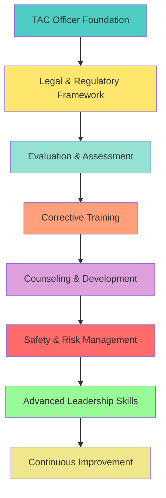

---
# You can also start simply with 'default'
theme: apple-basic
# random image from a curated Unsplash collection by Anthony
# like them? see https://unsplash.com/collections/94734566/slidev
background: https://cover.sli.dev
# some information about your slides (markdown enabled)
title: TAC Officer Training Guide
info: |
  ## TAC Officer Training Guide
  Comprehensive training for Teaching, Advising, and Counseling officers in the US Army Officer Candidate School.
  
  **DISCLAIMER:** This content is unofficial and based on personal observations. It does not represent official US Army views unless explicitly referencing doctrine.

  Learn more at [Sli.dev](https://sli.dev)
# apply unocss classes to the current slide
class: text-center
# https://sli.dev/features/drawing
drawings:
  persist: false
# slide transition: https://sli.dev/guide/animations.html#slide-transitions
transition: slide-left
# enable MDC Syntax: https://sli.dev/features/mdc
mdc: true
# open graph
# seoMeta:
#  ogImage: https://cover.sli.dev
---

# TAC Officer Training Guide

## Teaching, Advising, and Counseling Excellence

**Purpose:** To provide comprehensive guidance, best practices, and actionable insights for TAC officers supporting effective training and leadership development in the US Army Officer Candidate School.

**Mission:** Develop adaptive, ethical, and effective leaders for the Army through comprehensive training, evaluation, and mentorship.

---

# Table of Contents

::grid{cols=3 gap=4}

::card{title="Foundation" icon="🏗️"}
**Core Concepts**
- TAC Officer Role & Mission
- Army Values & Leadership
- Legal Framework & Compliance
- Risk Management & Safety
::

::card{title="Operations" icon="⚙️"}
**Daily Execution**
- Evaluation & Assessment
- Corrective Training
- Counseling & Development
- Daily Battle Rhythm
::

::card{title="Excellence" icon="🎯"}
**Advanced Skills**
- After Action Reviews
- Team Building & Cohesion
- Crisis Management
- Professional Development
::

::

---

# Important Disclaimers

::card{title="Unofficial Content" icon="⚠️"}
**This content is completely unofficial and based on personal observations and experience.**

**It does not represent the official views, policies, or positions of the US Army unless explicitly referencing established doctrine or regulations.**

**Always consult current Army regulations and your chain of command for official guidance.**
::

---

# Course Overview

---
title: OCS Honor Code

layout: quote
---

# OCS Honor Code

An Officer Candidate will not lie, cheat, steal, or tolerate those who do.

---
title: Proffer No Excuses

layout: quote
---

# Proffer No Excuses

Never volunteer excuses or explain a shortcoming unless an explanation is required. The Army demands results. More damage than good is done by proffering unsought excuses.

---
src: ./pages/tac-01-intro.md
---

---
src: ./pages/tac-02-knowledge.md
---

---
src: ./pages/tac-03-evaluation.md
---

---
src: ./pages/tac-04-correction.md
---

---
title: Applying Rigor and Productive Stress in Training
---

# Applying Rigor and Productive Stress in Training

## **Purpose and Principles**

::grid{cols=2 gap=6}

::card{title="Training Purpose" icon="🎯"}
**Objective:** Develop resilience, adaptability, and effective decision-making under pressure

**Principle:** Stress should be applied in a controlled, professional, and non-abusive manner to enhance learning and performance

**Outcome:** Candidates who can perform effectively under real-world pressures
::

::card{title="Stress Application Methods" icon="⚡"}
**Productive Techniques:**
- Time-limited task completion
- Controlled, professional urgency
- Complex, ambiguous scenarios
- Multitasking requirements
- Leadership role rotations
- Environmental variations

**Prohibited Methods:**
- Personal attacks or humiliation
- Excessive physical demands
- Hazing or bullying
- Discriminatory treatment
::

::

---
title: More Methods for Productive Stress
---

# Advanced Stress Application Techniques

::grid{cols=2 gap=4}

::card{title="Cognitive Stress" icon="🧠"}
**Mental Challenges:**
- Rapid decision-making requirements
- Information overload scenarios
- Competing priorities
- Resource limitations
- Time pressure
- Ambiguous instructions

**Implementation:**
- Sudden mission changes
- Complex problem sets
- Multiple simultaneous tasks
- Incomplete information
::

::card{title="Environmental Stress" icon="🌪️"}
**Situational Factors:**
- Noise and distractions
- Lighting variations
- Weather conditions
- Equipment limitations
- Physical discomfort
- Fatigue management

**Implementation:**
- Outdoor training in various weather
- Equipment failures
- Communication challenges
- Physical endurance events
::

::card{title="Social Stress" icon="👥"}
**Interpersonal Challenges:**
- Peer evaluations
- Leadership rotations
- Team conflicts
- Public performance
- Accountability measures
- Feedback sessions

**Implementation:**
- 360-degree feedback
- Leadership under observation
- Conflict resolution exercises
- Public presentations
::

::card{title="Operational Stress" icon="🎖️"}
**Mission-Related Pressure:**
- Mission failure consequences
- Safety considerations
- Resource management
- Timeline adherence
- Quality standards
- Performance metrics

**Implementation:**
- Realistic training scenarios
- Performance standards
- Consequence-based training
- Continuous assessment
::

::

> **Critical Note:** All stress-inducing methods must remain within ethical and regulatory boundaries. The goal is to prepare candidates for real-world challenges while maintaining dignity and respect.

---
src: ./pages/tac-17-risk-management.md
---

---
src: ./pages/tac-05-limitations.md
---

---
src: ./pages/tac-06-policies.md
---

---
src: ./pages/tac-11-daily-battle-rhythm.md
---

---
src: ./pages/tac-12-counseling-feedback.md
---

---
src: ./pages/tac-16-counseling-types.md
---

---
src: ./pages/tac-07-cohesion.md
---

---
src: ./pages/tac-08-communication.md
---

---
src: ./pages/tac-13-ethical-leadership.md
---

---
src: ./pages/tac-14-scenario-based-training.md
---

---
src: ./pages/tac-15-common-pitfalls.md
---

---
src: ./pages/tac-09-improvement.md
---

---
title: Key Takeaways and Action Items
---

# Key Takeaways and Action Items

## **Core Competencies Mastered**

::grid{cols=2 gap=6}

::card{title="Technical Skills" icon="🔧"}
**Achieved:**
- Evaluation methodology
- Corrective training procedures
- Risk management protocols
- Documentation standards

**Application:**
- Conduct fair evaluations
- Execute proper corrective actions
- Maintain safety standards
- Document actions properly
::

::card{title="Leadership Skills" icon="👨‍💼"}
**Developed:**
- Coaching and mentoring
- Conflict resolution
- Team building
- Communication
- Ethical decision-making

**Application:**
- Mentor candidates effectively
- Resolve conflicts constructively
- Build cohesive teams
- Communicate clearly
- Make ethical choices
::

::

---
title: Implementation Checklist
layout: two-cols
---

## **Implementation Checklist**

### Immediate Actions (First 30 Days)
- [ ] Establish candidate counseling schedule
- [ ] Implement risk management procedures
- [ ] Create documentation systems
- [ ] Build relationships with support staff

### Short-term Goals (30-90 Days)
- [ ] Conduct comprehensive candidate assessments
- [ ] Implement structured AAR processes
- [ ] Develop unit cohesion activities
- [ ] Establish professional development plan
- [ ] Create feedback mechanisms

::right::

### Long-term Objectives (90+ Days)
- [ ] Measure training effectiveness
- [ ] Refine evaluation procedures
- [ ] Develop advanced teaching methods
- [ ] Build professional network
- [ ] Contribute to program improvement

### Continuous Improvement
- [ ] Seek feedback from candidates
- [ ] Stay current with regulations
- [ ] Attend professional development
- [ ] Share best practices
- [ ] Mentor new TAC officers

---
src: ./pages/tac-10-conclusion.md
---

---
title: Resources and References
---

# Resources and References

## **Primary References**

::grid{cols=2 gap=4}

::card{title="Army Regulations" icon="📚"}
**Key Publications:**
- AR 600-20 - Army Command Policy
- AR 600-8-19 - Officer Professional Development
- AR 27-10 - Military Justice
- AR 350-1 - Training and Leader Development
- FM 6-22 - Leader Development

**Access:** [Army Publishing Directorate](https://armypubs.army.mil/)
::

::card{title="Professional Development" icon="🎓"}
**Training Resources:**
- Army Leader Development Strategy
- Officer Professional Development
- Leadership Assessment Program
- Combined Arms Center
- Center for Army Leadership

**Access:** [CAC](https://usacac.army.mil/)
::

::card{title="Legal Resources" icon="⚖️"}
**Support Services:**
- Staff Judge Advocate
- Legal Assistance Office
- Equal Opportunity Advisor
- Inspector General
- Military Police

**Access:** Local installation directory
::

::card{title="Online Resources" icon="🌐"}
**Digital Platforms:**
- Army Training Network (ATN)
- Military Leadership Exchange
- Joint Knowledge Online (JKO)
- Army Learning Management System
- Professional forums and communities

**Access:** CAC-enabled sites
::

::

## **Contact Information**

**Professional Support:**
- Chain of Command
- Peer TAC Officers
- Senior Leaders
- Subject Matter Experts
- Professional Organizations

---
title: Thank You
layout: center
---

# Thank You

## Excellence in Teaching, Advising, and Counseling

**"The strength of the Army lies in the quality of its leaders."**

**Your role as a TAC officer is fundamental to developing the next generation of Army leaders.**

---

**Questions and Discussion**

**Continue the conversation at:** [https://guide.tacai.app/](https://guide.tacai.app/)

**Remember:** Lead by example, uphold standards, and foster a positive learning environment.